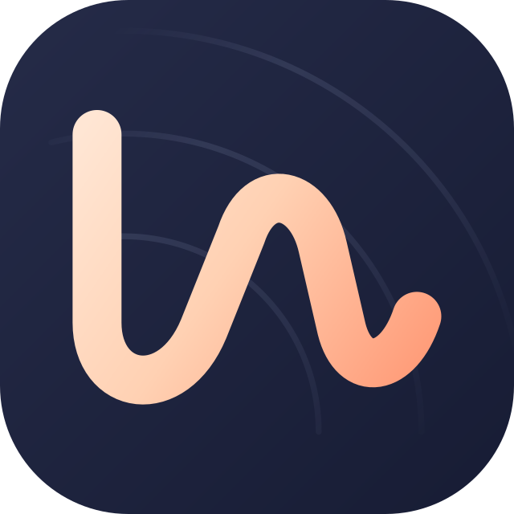

# Lee’s Music

### 你的音乐，随身聆听。

为自建音乐库打造的 Android 播放器。
连接 Navidrome，让收藏、歌单与熟悉的旋律回到手边。

[下载版本](https://github.com/lyq2010/lees-music/releases) · [更新记录](docs/CHANGELOG.md) · [反馈问题](https://github.com/lyq2010/lees-music/issues)

---

## 好好听歌，也好好管理收藏

- **浏览你的音乐库** — 歌曲、专辑、艺术家、收藏与个人歌单，集中呈现。
- **发现下一首** — 每日推荐、最近添加、最近播放与随机推荐。
- **快速找到想听的** — 按歌曲、专辑和艺术家搜索。
- **沉浸式歌词** — 跟随播放进度高亮，支持手动浏览与点击跳转；歌词内容取决于服务器提供的数据。
- **安排接下来的音乐** — 下一首播放、加入队列、调整顺序，以及随机与循环播放。
- **随时离线收听** — 下载原音质歌曲，查看下载状态与存储占用。

## 按你的习惯播放

| 功能 | 体验 |
| --- | --- |
| 后台播放 | 通知栏控制、耳机断开暂停、通知栏歌词 |
| 桌面小组件 | 1×1、2×2、3×2、4×1 四种规格，快捷控制播放 |
| 接着听 | 恢复上次的歌曲、队列与进度，启动保持暂停 |
| 播放手势 | 播放页下滑收起，底部播放条左右切歌 |
| 聆听调节 | 均衡器预设、歌曲间淡入淡出、播放速度、睡眠定时 |
| 外观个性化 | 跟随系统、浅色或深色模式，多种主题配色 |
| 网络与存储 | 在线音质选择、计费网络控制、播放缓存容量与清理 |
| 多服务器 | 保存并切换不同的 Navidrome 服务器 |

## 开始使用

1. 在 [Releases](https://github.com/lyq2010/lees-music/releases) 下载 APK，安装到 Android 8.0 或更高版本的设备。
2. 添加 Navidrome 服务器，填写地址与登录信息。
3. 打开音乐库，选择喜欢的歌曲。

当前提供正式版，支持 **Navidrome**；Emby、Plex 尚未接入。三星 S25 连续后台播放及网络切换已通过验收；退出崩溃修复版、小组件和系统媒体胶囊仍待真机确认。

## 音乐属于你

连接你自己的服务器，使用你自己的音乐收藏。无广告，不内置使用统计或第三方崩溃上报；服务器登录信息保存在设备本地。

## 反馈与参与

欢迎通过 [Issues](https://github.com/lyq2010/lees-music/issues) 报告问题或提出建议。反馈时请附上应用版本、设备型号、Android 版本及复现步骤，避免提交密码、令牌或私人服务器地址。

## 开源许可

Copyright © 2026 lyq2010。Lee’s Music 采用 [GNU GPL v3.0](LICENSE) 许可证；第三方组件见 [开源声明](docs/THIRD_PARTY_NOTICES.md)。
